# 📖 Metodología, Diseño y Desarrollo del Sistema (Capítulo para Tesis)

Este documento detalla exhaustivamente el marco de trabajo, la arquitectura, el diseño de la base de datos, los casos de uso y la ingeniería de Procesamiento de Lenguaje Natural (NLP) detrás del Chatbot Académico IA para la PUCE-SI. Además, incluye el código de los diagramas (en sintaxis PlantUML / PlantText) listos para ser renderizados e incluidos en el documento de tesis final.

---

## 1. Secuencia por Fases de Desarrollo

El desarrollo del sistema se estructuró bajo un enfoque iterativo y ágil, dividido en las siguientes fases críticas:

1. **Fase de Análisis y Modelado:** Levantamiento de requerimientos, diseño de la base de datos y flujos de usuario.
2. **Fase de Backend y RAG:** Construcción de la API en Django, implementación de FAISS, integración con OpenAI, y Web Scraping.
3. **Fase de Frontend y UI:** Desarrollo de la SPA en React (TailwindCSS, Glassmorphism).
4. **Fase de Integración y Seguridad:** Inyección de contexto al chatbot, JWT, Argon2, e implementación de Auditoría (ISO 27001).

A continuación, se detalla el diagrama de secuencia individual de cada fase.

### 1.1 Diagrama de Secuencia: Fase de Análisis y Modelado
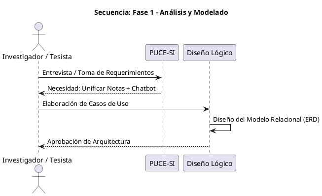

### 1.2 Diagrama de Secuencia: Fase de Backend y RAG
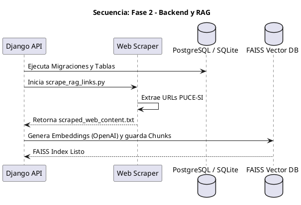

### 1.3 Diagrama de Secuencia: Fase de Frontend y UI
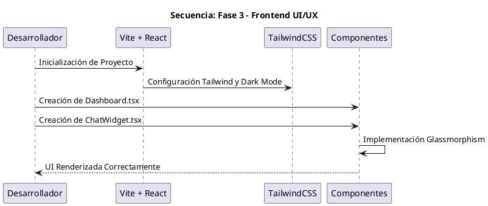

### 1.4 Diagrama de Secuencia: Fase de Integración y Seguridad
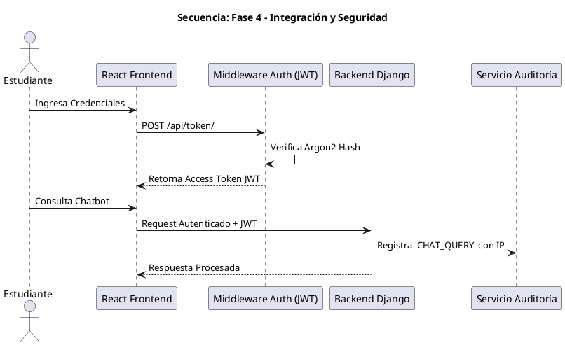

---

## 2. Arquitectura de Software

La aplicación sigue una **Arquitectura Cliente-Servidor Desacoplada** basada en micro-servicios lógicos. El Frontend consume el Backend exclusivamente a través de una API RESTful, lo que asegura escalabilidad independiente.

**Diagrama de Arquitectura (Código PlantText):**
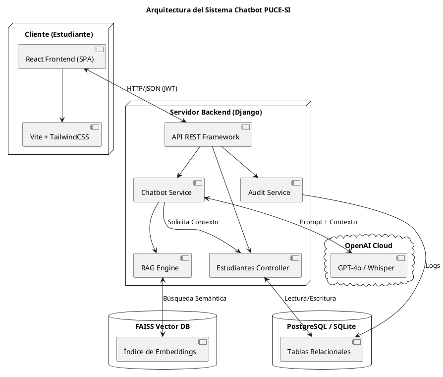

---

## 3. Casos de Uso y Alcance Funcional

El sistema contempla dos actores principales: el **Estudiante** (Usuario Final) y el **Administrador** (Auditor).

**Alcance Funcional del Estudiante:**
- Consultar horarios, calificaciones y subir deberes (Dashboard).
- Consultar al chatbot por voz o texto sobre temas académicos personales.
- Consultar información institucional pública (sin iniciar sesión).

**Diagrama de Casos de Uso (Código PlantText):**
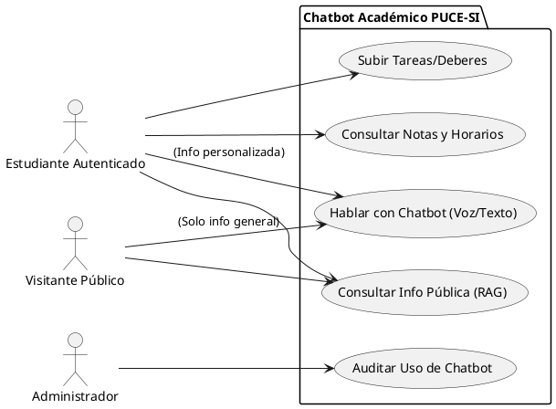

---

## 4. Base de Datos: Estructura y Relaciones

El sistema relacional fue diseñado con una alta normalización para evitar redundancia de datos. Las llaves primarias utilizan UUIDv4 para impedir ataques de enumeración.

**Diagrama Entidad-Relación (ERD) (Código PlantText):**
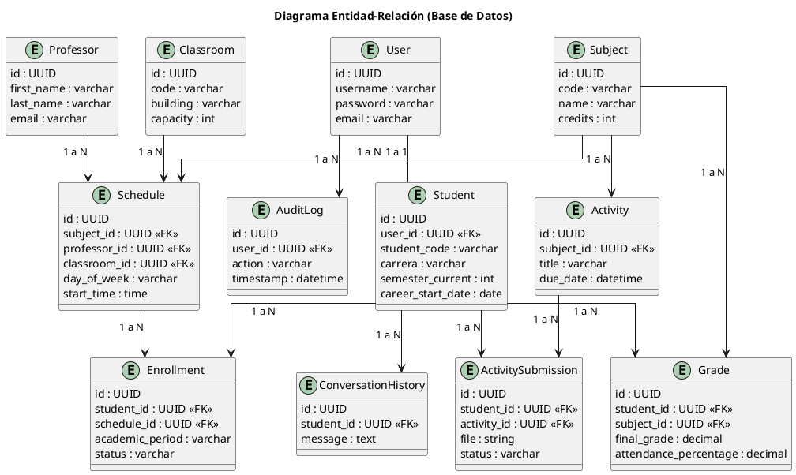

---

## 5. Base de Conocimiento del Sistema (RAG)

El RAG (Retrieval-Augmented Generation) resuelve el problema de la "desactualización" de la IA. El sistema mantiene su propia base de datos de conocimiento que lee automáticamente desde la web de la PUCE-SI.

**Diagrama de Flujo de Base de Conocimiento (Código PlantText):**
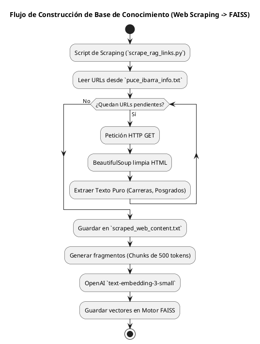

---

## 6. NLP (Procesamiento de Lenguaje Natural) y Diseño del Chatbot

El NLP del chatbot no recae en un modelo entrenado desde cero (Fine-Tuning), sino en la **Ingeniería de Prompts Contextuales**. Se utiliza el modelo GPT-4o-Mini por su bajo costo computacional y altísima precisión semántica.

**El "Prompt Maestro" Exacto utilizado en la configuración:**
```text
Eres el asistente académico oficial "AcadBot PUCESI".
REGLAS DE TIEMPO Y CONTEXTO:
1. Habla en PRESENTE para el periodo actual.
2. Habla en PASADO para cualquier periodo anterior.
3. Si el estudiante pregunta por detalles de semestres pasados, dáselos con precisión basándote en el HISTORIAL ACADÉMICO.
4. Jamás inventes datos. Si la info no está en el contexto, indícalo.
5. REGLA DE PRIVACIDAD ESTRICTA: Si el texto de documentos incluye detalles sobre 'DESCUENTOS Y BECAS', NO reveles esta info a menos que tengas el CONTEXTO DEL ESTUDIANTE AUTENTICADO.
6. Sé profesional, conciso y directo. RESPONDE EN MENOS DE 3 ORACIONES.
```

**Diagrama de Flujo de Consulta (NLP en Acción) (Código PlantText):**
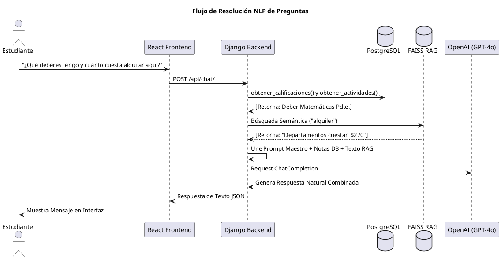

---

## 7. Diseño de la Interfaz Visual (UI/UX)

La interfaz fue diseñada con **React y TailwindCSS**, alejándose del diseño corporativo plano para adoptar un enfoque moderno para jóvenes universitarios:
1. **Glassmorphism:** Los contenedores del Dashboard tienen fondos translúcidos con desenfoque (blur), emulando vidrio esmerilado sobre un fondo degradado.
2. **Dark Mode Ergonómico:** Se utiliza un esquema de colores oscuros (slate/blue) que reduce la fatiga visual, ideal para estudiantes que acceden de noche.
3. **ChatWidget Flotante:** Permite al usuario hablar con el chatbot sin perder de vista la información del fondo (sus notas u horarios). Incluye retroalimentación háptica visual (animación de grabación del micrófono `lucide-react`).

**Diagrama de Jerarquía de Componentes (Código PlantText):**
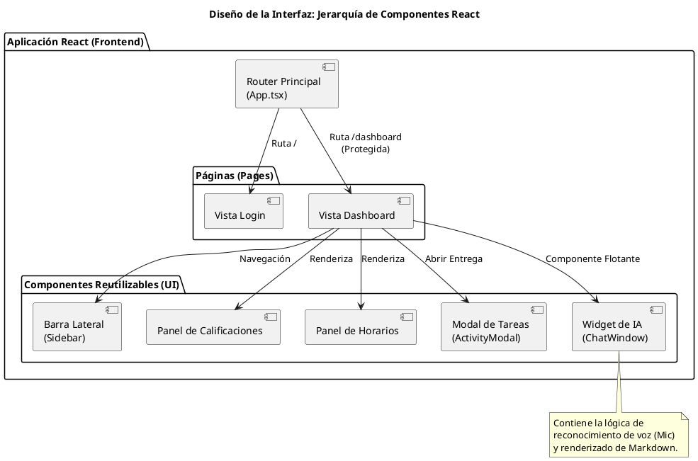

### 7.1 Diseño del Chatbot Flotante — Estado Cerrado (Botón Circular)

El chatbot se presenta como un **botón flotante circular** posicionado en la esquina inferior derecha de la pantalla (`fixed bottom-8 right-8`). El botón contiene el logo institucional de la PUCE-SI y permanece visible en todo momento sobre cualquier página del sistema (Dashboard, Login público, etc.).

Al hacer clic en el botón, se despliega la ventana de conversación con una animación fluida (`framer-motion`: scale 0→1, opacity 0→1).

**Diagrama del Botón Flotante — Estado Cerrado (Código PlantText):**
```plantuml
@startuml
title Chatbot Flotante — Estado Cerrado (Botón de Activación)
skinparam backgroundColor #F8FAFC
skinparam defaultFontName Arial
skinparam defaultFontSize 11

rectangle "Pantalla del Navegador (Dashboard / Página Pública)" as Screen #E2E8F0 {

  rectangle "Barra Lateral\n(Sidebar)" as SB #334155 {
  }

  rectangle "Contenido Principal\n(Dashboard: Notas, Horarios, Tareas)" as Content #FFFFFF {
    rectangle "Panel de\nCalificaciones" as P1 #F1F5F9
    rectangle "Panel de\nHorarios" as P2 #F1F5F9
  }

}

' Botón flotante del chatbot
circle "  Logo\n PUCE  " as FAB #FFFFFF ##0033A0

note right of FAB #FFFDE7
  <b>Botón Flotante (FAB)</b>
  ────────────────────────
  • Posición: <b>fixed bottom-8 right-8</b>
  • Tamaño: <b>64x64 px</b> (w-16 h-16)
  • Fondo: <b>blanco</b> con sombra 2XL
  • Borde: <b>1px solid gray-100</b>
  • Contenido: Logo PUCE-SI (imagen)
  • Hover: <b>scale(1.10)</b>
  • Click: <b>scale(0.95)</b> → abre ventana
  • Z-index: <b>50</b>
  • Animación entrada: scale 0→1
    con framer-motion (delay 0.1s)
end note

' Flecha anotada señalando el botón
Content -[hidden]down-> FAB

@enduml
```

### 7.2 Diseño del Chatbot Flotante — Estado Abierto (Ventana de Conversación)

Al hacer clic en el botón flotante, se despliega una **ventana de chat** con dimensiones fijas de `384px de ancho × 580px de alto` (`w-96 h-[580px]`), que se superpone al contenido sin reemplazar la página. La ventana contiene tres zonas principales:

1. **Cabecera (Header):** Fondo azul institucional (#0033A0), logo PUCE en círculo blanco, nombre "AcadBot PUCESI", indicador de estado (punto verde pulsante), modo de operación ("Portal Estudiantil" o "Atención Pública") y botón de cerrar (X).

2. **Área de Mensajes:** Fondo gris claro (#F9FAFB), burbujas de usuario (azul celeste #00AEEF, alineadas a la derecha) y burbujas del asistente (blanco con borde, alineadas a la izquierda). Indicador de "escribiendo..." con 3 puntos animados (bounce).

3. **Área de Entrada:** Campo de texto redondeado, botón de micrófono (gris, se vuelve rojo pulsante al grabar) y botón de enviar (azul celeste #00AEEF). Pie de página "Desarrollado para PUCE Sede Ibarra".

**Diagrama de la Ventana de Chat — Estado Abierto (Código PlantText):**
```plantuml
@startuml
title Chatbot Flotante — Estado Abierto (Ventana de Conversación)
skinparam backgroundColor #F8FAFC
skinparam defaultFontName Arial
skinparam defaultFontSize 10

rectangle "Ventana del Chatbot\n(w-96 = 384px, h-[580px])\nfixed bottom-8 right-8\nz-index: 100\nborder-radius: 24px (rounded-3xl)\nshadow-2xl" as Window #FFFFFF {

  rectangle "<color:#FFFFFF><b>  ● Logo PUCE  |  AcadBot PUCESI</b>\n  <color:#90EE90>●</color> Portal Estudiantil           <color:#FFFFFF><b>✕</b></color></color>" as Header #0033A0

  rectangle "Área de Mensajes (flex-1, overflow-y-auto)" as MsgArea #F9FAFB {

    rectangle "<color:#FFFFFF>¿Cuáles son mis notas\n de Programación?</color>" as UserMsg1 #00AEEF

    rectangle "Según tu expediente, en\nProgramación I obtuviste\n168/200 (Aprobado)." as BotMsg1 #FFFFFF ##E5E7EB

    rectangle "<color:#FFFFFF>¿Qué deberes tengo\npendientes?</color>" as UserMsg2 #00AEEF

    rectangle "Tienes 1 deber pendiente:\nMatemáticas - Ejercicios\nCap. 5 (entrega: 15/Jun)." as BotMsg2 #FFFFFF ##E5E7EB

    rectangle "<color:#00AEEF>●  ●  ●</color>\n(escribiendo...)" as Typing #FFFFFF ##E5E7EB

  }

  rectangle "Área de Entrada (Input)" as InputArea #FFFFFF {
    rectangle "  Escribe tu consulta...                    " as InputField #F9FAFB ##E5E7EB
    circle " 🎤 " as MicBtn #F3F4F6
    circle " ➤ " as SendBtn #00AEEF
  }

  rectangle "<size:8><color:#9CA3AF>Desarrollado para PUCE Sede Ibarra</color></size>" as Footer #FFFFFF

}

note right of Header #E0F2FE
  <b>Header (Cabecera)</b>
  ─────────────────────
  • Fondo: <b>#0033A0</b> (azul PUCE)
  • Logo: círculo blanco 40x40px
  • Título: "AcadBot PUCESI" (bold)
  • Estado: punto verde pulsante
    (animate-pulse)
  • Modo: "Portal Estudiantil"
    o "Atención Pública"
  • Botón ✕: cierra la ventana
end note

note right of UserMsg1 #DBEAFE
  <b>Burbuja del Usuario</b>
  ─────────────────────
  • Fondo: <b>#00AEEF</b> (celeste)
  • Texto: <b>blanco</b>
  • Alineación: <b>derecha</b>
  • Border-radius: 16px
    (esquina sup-der: 2px)
  • max-width: 85%
end note

note right of BotMsg1 #F0FDF4
  <b>Burbuja del Asistente</b>
  ─────────────────────
  • Fondo: <b>blanco</b>
  • Borde: <b>1px gray-200</b>
  • Texto: <b>gray-800</b>
  • Alineación: <b>izquierda</b>
  • Border-radius: 16px
    (esquina sup-izq: 2px)
end note

note right of MicBtn #FEF2F2
  <b>Botón Micrófono</b>
  ─────────────────
  • Reposo: gris (#F3F4F6)
  • Grabando: <b>rojo (#EF4444)</b>
    + animate-pulse + scale(1.1)
  • Acción: mantener presionado
    (onMouseDown → onMouseUp)
  • Usa: MediaRecorder API
    + Whisper (OpenAI)
end note

note right of SendBtn #DBEAFE
  <b>Botón Enviar</b>
  ──────────────
  • Fondo: <b>#00AEEF</b>
  • Ícono: flecha (Send)
  • Disabled si: loading,
    grabando o input vacío
  • Hover: #0096CE
  • Click: scale(0.95)
end note

@enduml
```

### 7.3 Diagrama de Flujo de Interacción del Chatbot (Texto y Voz)

El siguiente diagrama muestra el flujo completo de interacción del usuario con el chatbot, tanto en modalidad de **texto** como de **voz**:

**Diagrama de Flujo de Interacción (Código PlantText):**
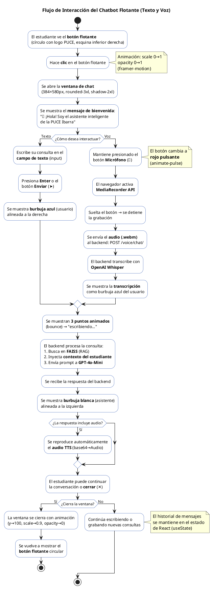

### 7.4 Diagrama de Wireframe del Chatbot — Vista General con Anotaciones

El siguiente diagrama presenta una vista general del comportamiento del chatbot en sus dos estados (cerrado y abierto) con flechas de transición:

```plantuml
@startuml
title Vista General: Transición del Chatbot Flotante (Cerrado → Abierto)
skinparam backgroundColor #FFFFFF
skinparam defaultFontName Arial
skinparam defaultFontSize 10

rectangle "ESTADO 1: CERRADO" as E1 {
  rectangle "Página Web (Dashboard)" as Page1 #F1F5F9 {
    rectangle "Sidebar" as SB1 #1E293B
    rectangle "Contenido\n(Notas / Horarios)" as C1 #FFFFFF
  }
  circle "Logo\nPUCE" as Btn #FFFFFF ##0033A0
  note bottom of Btn #FFFDE7
    <b>Botón FAB</b>
    64×64px
    Posición fija
    z-index: 50
  end note
}

rectangle "ESTADO 2: ABIERTO" as E2 {
  rectangle "Página Web (Dashboard)" as Page2 #F1F5F9 {
    rectangle "Sidebar" as SB2 #1E293B
    rectangle "Contenido\n(visible detrás)" as C2 #FFFFFF
  }
  rectangle "Ventana Chat" as Chat #FFFFFF ##0033A0 {
    rectangle "<b><color:#FFF>AcadBot PUCESI  ✕</color></b>" as H2 #0033A0
    rectangle "👋 ¡Hola! Soy el\nasistente de PUCE" as Msg #F9FAFB
    rectangle "[Escribe tu consulta...] 🎤 ➤" as In2 #FFFFFF ##E5E7EB
  }
  note bottom of Chat #E0F2FE
    <b>Ventana Chat</b>
    384×580px
    Posición fija
    z-index: 100
    rounded-3xl
  end note
}

Btn -right[#0033A0,bold]-> Chat : <b>Click</b>\n<color:#0033A0>Animación:\nscale(0→1)\nopacity(0→1)</color>

note top of E1 #F0FDF4
  El botón flotante está siempre
  visible sobre el contenido.
  No interfiere con la navegación.
end note

note top of E2 #FEF2F2
  La ventana de chat se superpone
  al contenido sin reemplazar la página.
  El usuario puede cerrarla con ✕.
end note

@enduml
```

---

## 8. Sprint 5: Seguridad, Auditoría y Endurecimiento del Sistema

### 8.1 Historia de Usuario del Sprint 5

**S-5 — Acceso seguro al aula virtual**

> *"Como estudiante, quiero ingresar al aula virtual de forma segura para garantizar que mis credenciales, datos académicos y sesiones estén protegidos contra accesos no autorizados."*

**Estimación:** 10 días (lunes a viernes, 4 horas/día)  
**Importancia:** Alta  
**Dependencias:** S-1, S-2, S-3, S-4

### 8.2 Desglose de Tareas del Sprint 5

| ID de Tarea | Tarea | Días | Detalle Técnico |
|:---|:---|:---|:---|
| S-5-1 | Implementación de hashing Argon2 y validadores de contraseña | 2 | Configurar `PASSWORD_HASHERS` con Argon2 como primario y PBKDF2 como fallback. Activar 4 validadores: similitud, longitud mínima (8), contraseñas comunes y numéricas puras. |
| S-5-2 | Configuración de autenticación JWT | 2 | Configurar `SimpleJWT` con Access Token de 15 min, Refresh de 7 días, rotación obligatoria (`ROTATE_REFRESH_TOKENS`), blacklist tras rotación, algoritmo HS256. |
| S-5-3 | Implementación de 2FA con OTP vía email | 2 | Crear modelo `OTPToken` con expiración de 5 min, servicio `OTPService` (generación de 6 dígitos, envío por email, invalidación de OTP anteriores), integración con el flujo de login. |
| S-5-4 | Bloqueo automático de cuentas | 1 | Implementar `increment_failed_attempts()` en el modelo `User`: bloqueo tras 5 intentos fallidos durante 15 minutos. Propiedad `is_locked` y método `reset_failed_attempts()`. |
| S-5-5 | Implementación de Rate Limiting | 1 | Configurar `DEFAULT_THROTTLE_RATES` en DRF: anónimo (20/min), autenticado (100/min), login (5/min). Aplicar `throttle_scope='login'` a las vistas de autenticación. |
| S-5-6 | Registro de auditoría (AuditLog) | 2 | Crear modelo `AuditLog` con 13 acciones, 3 niveles de severidad, campos IP/user-agent/metadata(JSON). Crear servicio `AuditLogService` centralizado con métodos especializados. Añadir 3 índices compuestos. |
| S-5-7 | Dashboard de auditoría para administradores | 1 | Crear `AuditLogListView` (paginación 50/página, filtros por acción/severidad) y `ChatbotUsageStatsView` (estadísticas con filtros de fecha/usuario). Permisos `IsAdminUser`. |
| S-5-8 | Configuración de CORS y cabeceras seguras | 1 | Configurar `CORS_ALLOWED_ORIGINS`, `SESSION_COOKIE_HTTPONLY`, `SESSION_COOKIE_SAMESITE=Lax`, `CSRF_COOKIE_SAMESITE=Lax`, middleware `SecurityMiddleware` y `XFrameOptionsMiddleware`. |
| S-5-9 | UUIDv4 y variables de entorno | 1 | Usar `uuid.uuid4` como PK en todas las tablas. Migrar todas las credenciales a `.env` con `python-decouple`. Crear `.env.example` documentado. |
| S-5-10 | Pruebas integrales de seguridad y auditoría | 2 | Validar: login con OTP, bloqueo por fuerza bruta, expiración de tokens, rotación de refresh, inmutabilidad de logs, throttling, CORS bloqueado desde origen no autorizado. |

### 8.3 Diagrama de Secuencia: Flujo de Autenticación Segura (JWT + 2FA)

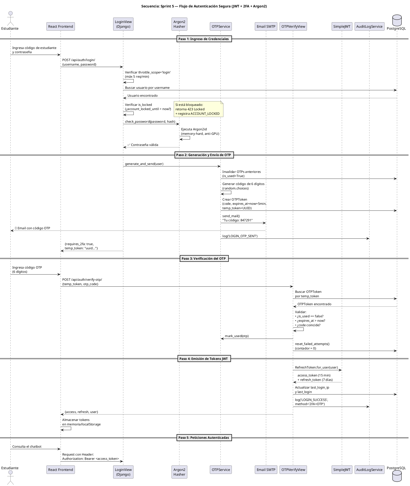

### 8.4 Diagrama de Secuencia: Flujo de Auditoría (ISO 27001)

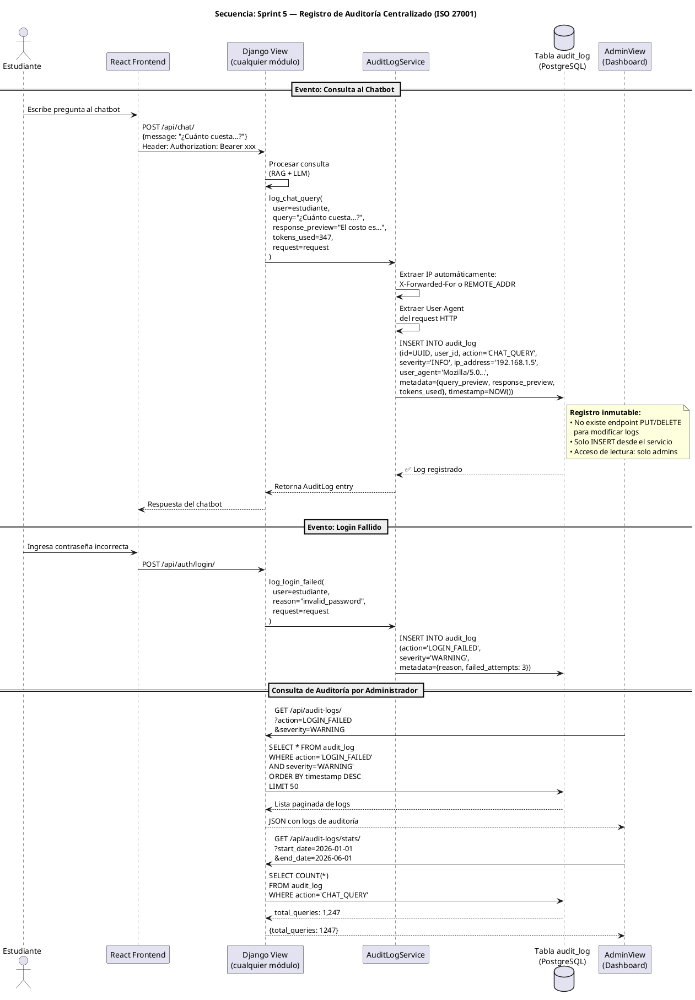

### 8.5 Diagrama de Arquitectura de Seguridad (Capas de Defensa)

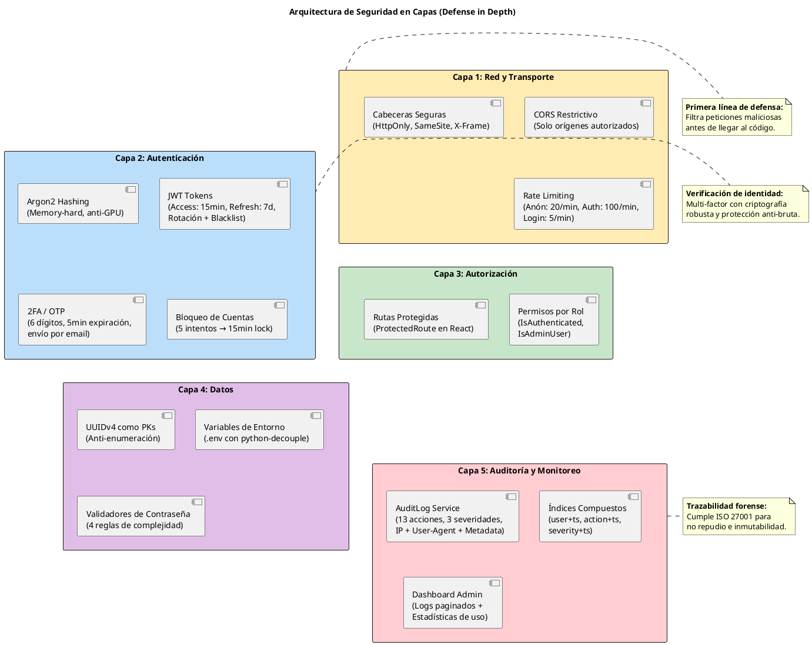

### 8.6 Tabla Resumen de Controles de Seguridad Implementados

| # | Control | Norma/Estándar | Archivo en el Código | Línea Aprox. |
|:---|:---|:---|:---|:---|
| 1 | Hashing Argon2 | OWASP, PHC 2015 | `backend/config/settings/base.py` | 104 |
| 2 | Validadores de contraseña (4) | OWASP | `backend/config/settings/base.py` | 95 |
| 3 | JWT con rotación y blacklist | RFC 7519, OAuth 2.0 | `backend/config/settings/base.py` | 147 |
| 4 | 2FA / OTP por email | ISO 27001 A.9.4.2 | `backend/apps/authentication/services.py` | 18 |
| 5 | Bloqueo por intentos fallidos | ISO 27001 A.9.4.3 | `backend/apps/authentication/models.py` | 48 |
| 6 | Rate Limiting (3 niveles) | OWASP API Security | `backend/config/settings/base.py` | 132 |
| 7 | CORS restrictivo | OWASP | `backend/config/settings/base.py` | 163 |
| 8 | Cookies HttpOnly + SameSite | OWASP | `backend/config/settings/base.py` | 217 |
| 9 | X-Frame-Options (Clickjacking) | OWASP | `backend/config/settings/base.py` | Middleware |
| 10 | UUIDv4 como PKs | OWASP (IDOR) | Todos los modelos | Línea `id = models.UUIDField(...)` |
| 11 | Variables de entorno (.env) | 12-Factor App | `backend/config/settings/base.py` | 13 |
| 12 | AuditLog (13 acciones) | ISO 27001 A.12.4 | `backend/apps/audit_logs/models.py` | 9 |
| 13 | Servicio centralizado de auditoría | ISO 27001 A.12.4 | `backend/apps/audit_logs/services.py` | 13 |
| 14 | Dashboard de auditoría (admin) | ISO 27001 A.12.4 | `backend/apps/audit_logs/views.py` | 12 |
